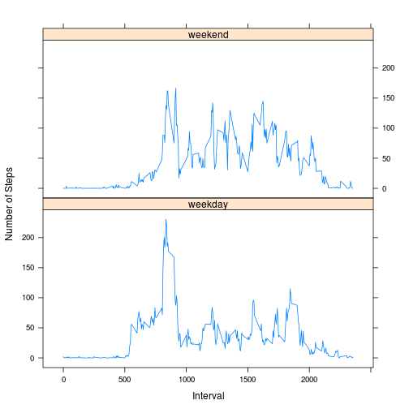

# Reproducible Research: Peer Assessment 1


## Loading and preprocessing the data


```r
setwd("~/Documents/Coursera Courses/Reproducible Research/Week 2")
rm(list = ls())
library(lattice)
dat <- read.csv("activity.csv")
dat$date <- as.Date(dat$date)  # convert dates from factor to datetime
```


## What is mean total number of steps taken per day?


```r
steps <- aggregate(x = dat$steps, by = list(dat$date), FUN = "sum")$x  # steps col
hist(steps)
```

 

```r
cat("The mean total number of steps taken per day is:", mean(na.omit(steps)), 
    "\n")
```

```
## The mean total number of steps taken per day is: 10766
```

```r
cat("The median total number of steps taken per day is:", median(na.omit(steps)), 
    "\n")
```

```
## The median total number of steps taken per day is: 10765
```


## What is the average daily activity pattern?


```r
daily <- aggregate(x = dat$steps, by = list(dat$interval), FUN = "mean", na.rm = "TRUE")
names(daily)[1] <- paste("interval")  # give columns descriptive names
names(daily)[2] <- paste("meanval")
plot(daily$meanval, type = "l", xlab = "5-minute interval #", ylab = "average number of steps taken", 
    main = "Avg number of steps taken VS 5-minute interval #")
```

 

```r
cat("The 5-minute interval that, on average, contains the maximum number of steps:", 
    which(daily$meanval == max(daily$meanval)), "\n")
```

```
## The 5-minute interval that, on average, contains the maximum number of steps: 104
```


## Imputing missing values


```r
cat("The total number of missing values in the dataset:", sum(is.na(dat$steps)), 
    "\n")
```

```
## The total number of missing values in the dataset: 2304
```

### Code strategy for imputing missing data
We'll replace NAs with the mean for each 5-minute interval averaged over all days in the dataset, and create a new dataset that is equal to the original dataset but with the missing data filled in.

```r
newdat <- dat
newdat$steps[is.na(newdat$steps)] <- daily[match(newdat$interval[is.na(newdat$steps)], 
    daily$interval), "meanval"]
steps <- aggregate(x = newdat$steps, by = list(newdat$date), FUN = "sum")$x  # steps col
hist(steps, xlab = "Number of Steps taken each day", ylab = "Frequency of occurence", 
    main = "Histogram of the Total Number of Steps Taken Each Day")
```

 

```r
cat("The mean total number of steps taken each day (with imputed data) is:", 
    mean(steps), "\n")
```

```
## The mean total number of steps taken each day (with imputed data) is: 10766
```

```r
cat("The median total number of steps taken each day (with imputed data) is:", 
    median(steps), "\n")
```

```
## The median total number of steps taken each day (with imputed data) is: 10766
```


## Are there differences in activity patterns between weekdays and weekends?


```r
newdat[, "typeday"] <- factor((weekdays(dat$date) == "Saturday" | weekdays(dat$date) == 
    "Sunday"), labels = c("weekday", "weekend"))
avgsteps <- aggregate(newdat$steps ~ newdat$interval + newdat$typeday, FUN = mean)
names(avgsteps)[1] <- paste("interval")  # give columns descriptive names
names(avgsteps)[2] <- paste("typeday")
names(avgsteps)[3] <- paste("meanval")
xyplot(avgsteps$meanval ~ avgsteps$interval | avgsteps$typeday, layout = c(1, 
    2), type = "l", xlab = "Interval", ylab = "Number of Steps")
```

 

Yes there are differences in activity patterns between weekdays and weekends, as the graphs above indicate.
